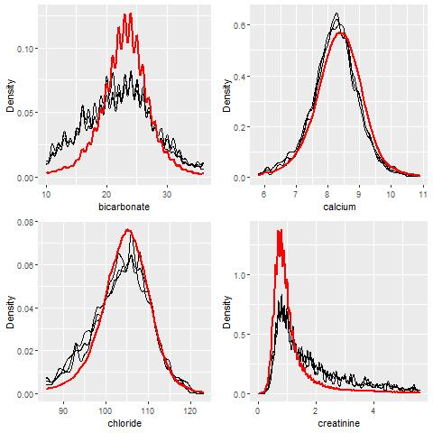
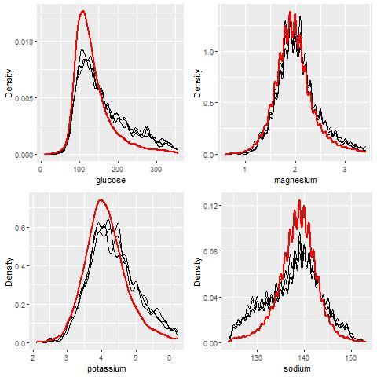
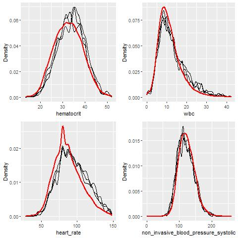
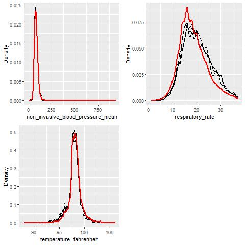
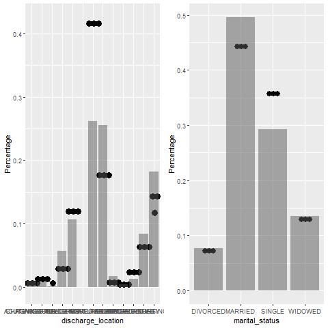
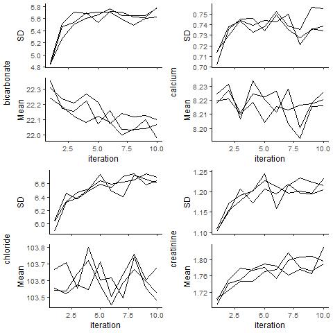
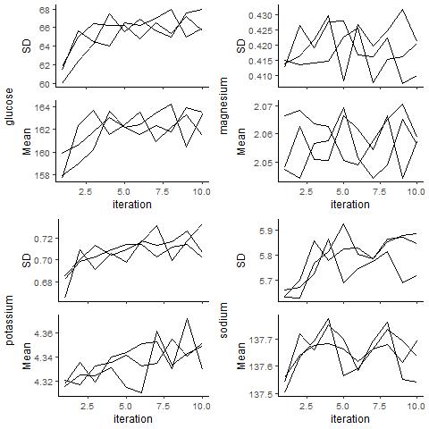
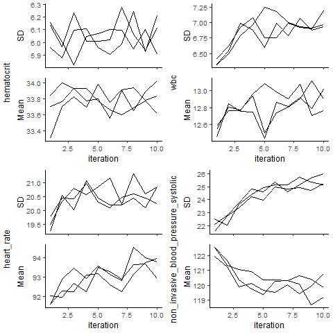
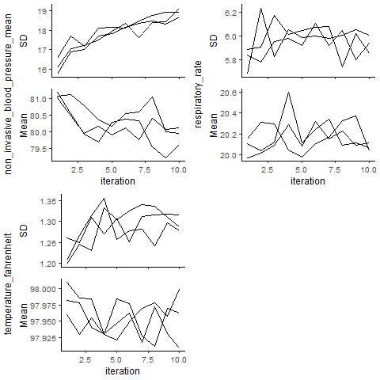
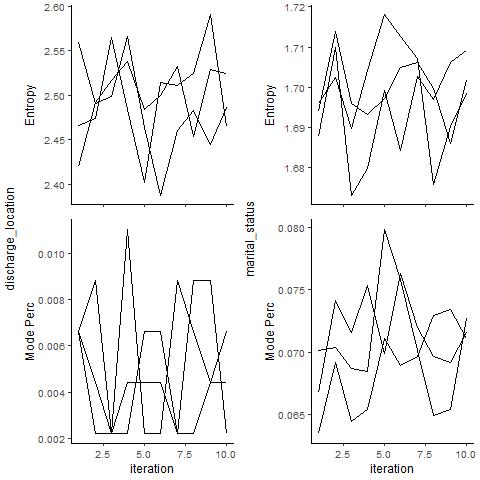

```{r setup, include = FALSE}
knitr::opts_chunk$set(echo = TRUE, cache = TRUE)
# default cache is false, previous result are saved!
```
                      
Display machine information:
```{r}
sessionInfo()
```
Load database libraries and the tidyverse frontend:
```{r}
if (!require("pacman")){
  install.packages("pacman", repos='http://cran.us.r-project.org')
}
p_load("tidyverse", "magrittr", "plyr", "purrr",
       "lubridate", "miceRanger", "knitr")
```

## Q1. Missing data

Through the Shiny app developed in HW3, we observe abundant missing values in the MIMIC-IV ICU cohort we created. In this question, we use multiple imputation to obtain a data set without missing values.

0. Read following tutorials on the R package miceRanger for imputation: <https://github.com/farrellday/miceRanger>, <https://cran.r-project.org/web/packages/miceRanger/vignettes/miceAlgorithm.html>.

    A more thorough book treatment of the practical imputation strategies is the book [*_Flexible Imputation of Missing Data_*](https://stefvanbuuren.name/fimd/) by Stef van Buuren. 

    **Solution**:

    Read the tutorial for `miceRanger`.

1. Explain the jargon MCAR, MAR, and MNAR.

    **Solution**:

    *MCAR*: represents for missing completely at random. Missingness does not depend on either observed or unobserved quantities. 

    *MAR*: represents for missing at random. Missingness depends on observed quantities could be any other variables

    *MNAR*: represents for missing not at random. Missingness may depend on unobserved quantities itself. The probability of being missing varies for reasons that are unknown.

2. Explain in a couple of sentences how the Multiple Imputation by Chained Equations (MICE) work.

    **Solution**:
    
    First, a simple imputation such as imputing the mean is performed for every missing value in the dataset. These mean imputations can be thought of as "place holders". Next, The "place holder" mean imputations for one variable (noted as X below) are set back to missing.The observed values from X in last step are regressed on the other variables in the imputation model under the same assumptions that one would make when performing linear, logistic or posion regression models outside of the context of imputing missing data. The missing values for X are then replaced with predictions (imputations) from the regression model. When "var" is subsequently used as an independent variable in the regression models for other variables, both the observed and these imputed values will be used. Repeat the steps for each variable that has missing data. The cycling through each of the variables consititutes one iteration. At the end of one cycle all of the missing values have been replaced with predictions from regressions that reflect the relationships observed in the data.Repeat the cycles with the imputations being updated at each cycle. 

3. Perform a data quality check of the ICU stays data. Discard variables with substantial missingness, say >5000 `NA`s. Replace apparent data entry errors by `NA`s.

      **Solution**:
      
      For the outliers, use $mean\ \pm\ 3sd$ as a threshold.
      
    ```{r, echo = FALSE}
    # Set the path
    # os <- sessionInfo()$running
    # if (str_detect(os, "Linux")) {
    #   repo_path <- "/home/yingyanwu/biostat-203b-2021-winter"
    #   } else if (str_detect(os, "Windows")) {
    #   repo_path <- paste0("C:/Users/Yingyan Wu/OneDrive - UCLA IT Services", 
    #                       "/2021 Winter/BIOS 203B/biostat-203b-2021-winter")
    #   }
    ```
    
    
    ```{r}
    #---- Load the data ----
    icustays <- 
      readRDS(paste0("../hw3/mimiciv_shiny", "/icu_cohort.rds")) %>%
      print(width = Inf)
    
    #---- Missingness ----
    missingness_df <- function(dataframe){
      estimate <- function(x){
        stats <- sum(is.na(x))
        names(stats) <- "n_missing"
        return(stats)
      }
      stats_tbl <- dataframe %>%
        # select(-contains("id")) %>%
        purrr::map_dfr(estimate) %>%
        mutate("variable" = colnames(dataframe)) %>%
        as_tibble() %>%
        select(variable, everything())
      return(stats_tbl)
    }
    
    var_discard <- 
      missingness_df(icustays) %>%
      filter(n_missing > 5000) %>%
      print(width = Inf)
    
    icustays_clean <- icustays %>%
      select(!var_discard$variable) %>%
      print(width = Inf)
    
    #---- Apparent data entry errors ----
    estimate_df <- function(dataframe){
      estimate <- function(x){
        stats <- 
          c(length(x), 
            mean(x,na.rm = T), 
            median(x,na.rm = T),
            sd(x,na.rm = T),
            min(x,na.rm = T),
            max(x,na.rm = T),
            (abs(max(x,na.rm = T) -  mean(x,na.rm = T)) > 3 * sd(x,na.rm = T)),
            # sum(x,na.rm = T), sum(is.na(x)),
            quantile(x,c(0.025, 0.975),na.rm = T)
          )
        names(stats) <- c("N", "Mean", "Median",
                          "Sd", "Min", "Max",
                          "Outliers",
                          # "Sum", "Missing"
                          "p2.5th", "p97.5th"
        )
        return(round(stats, 4))
      }
      
      stats_tib <- dataframe %>%
        select(where(is.numeric)) %>%
        purrr::map_dfr(estimate) %>%
        as_tibble() %>%
        mutate("variable" = colnames(dataframe)) %>%
        select(variable, everything())
      
      return(stats_tib)
    }
    
    # based on the app created previously, 
    # and also the results for checking below to clean the outliers
    labvar <- c("bicarbonate", "calcium", "chloride", "creatinine", "glucose", 
                "magnesium", "potassium", "sodium", "hematocrit", "wbc")
    vitalvar <- c("heart_rate", 
                  "non_invasive_blood_pressure_systolic",
                  "non_invasive_blood_pressure_mean",
                  "respiratory_rate",
                  "temperature_fahrenheit")
    
    # Clean the outliers (falls beyond mean +/- 3sd)   
    stats <- icustays_clean %>%
      select(all_of(labvar), all_of(vitalvar)) %>%
      estimate_df() %>%
      print(width = Inf)
    
    outlier_func <- function(x) {
      if (is.numeric(x)){x <- ifelse(
        (abs(x -  mean(x,na.rm = T)) > 3 * sd(x,na.rm = T)),
        NA, x)
      }
    }
    
    var_clean <- icustays_clean %>%
      select(all_of(labvar), all_of(vitalvar)) %>%
      purrr::map_dfc(outlier_func)
    
    icustays_clean[, colnames(var_clean)] <- var_clean
    
    ```
    

4. Impute missing values by `miceRanger` (request $m=3$ datasets). This step is very computational intensive. Make sure to save the imputation results as a file.

    **Solutions**:

    ```{r, eval = FALSE}
    # ---- multiple imputation with 3 datasets and 10 iteration ----
    # Don't need to do the multiple imputation in parallel
    # library(doParallel)
    # cl <- makeCluster(10)
    # registerDoParallel(cl)
    
    system.time(icustays_mice <- miceRanger(
      icustays_clean, m = 3, maxiter = 10, 
      # parallel = FALSE, 
      returnModels = FALSE, 
      verbose = TRUE, 
      max.depth = 10 #set max.depth=10 to reduce the runtime
                # Details see https://github.com/FarrellDay/miceRanger/issues/6
    ))
    # stopCluster(cl)
    # registerDoSEQ()
    
    ```

5. Make imputation diagnostic plots and explain what they mean.

    **Solution**:

    ```{r, eval = FALSE}
    #---- Diagnositic plots ----
    # plotVarConvergence(icustays_mice, vars = "allNumeric")
    # plotDistributions(icustays_mice, vars = "allNumeric")
    
    # For a clearer view of the diagnostic plots
    # imputed numeric variables vectors
    var_1_4 <- c("bicarbonate", "calcium", "chloride", "creatinine")
    var_5_8 <- c("glucose", "magnesium", "potassium", "sodium")
    var_9_12 <- c("hematocrit", "wbc", "heart_rate", 
                  "non_invasive_blood_pressure_systolic")
    var_13_15 <- c("non_invasive_blood_pressure_mean",
                  "respiratory_rate",
                  "temperature_fahrenheit")
    var_num <- c(var_1_4, var_5_8, var_9_12, var_13_15)
    var_char <- c("discharge_location", "marital_status")
    
    # Didn't work
    # var_list <- list(var_1_4, var_5_8, var_9_12, var_13_15)
    # for (i in 1:4){
    #   jpegpath <- paste0("../hw4", "/Imputation_diagnostic_figures", 
    #                     "/Distribution_",i, ".jpeg" )
    # jpeg(file = jpegpath)
    #   plotDistributions(icustays_mice, vars = varlist[[i]])
    #   dev.off()
    # }
    
    # Distribution plots
    jpeg("Distribution_1.jpeg")
    plotDistributions(icustays_mice, vars = var_1_4)
    dev.off()
    
    jpeg("Distribution_2.jpeg")
    plotDistributions(icustays_mice, vars = var_5_8)
    dev.off()
    
    jpeg("Distribution_3.jpeg")
    plotDistributions(icustays_mice, vars = var_9_12)
    dev.off()
    
    jpeg("Distribution_4.jpeg")
    plotDistributions(icustays_mice, vars = var_13_15)
    dev.off()
    
    jpeg("Distribution_5.jpeg")
    plotDistributions(icustays_mice, vars = var_char)
    dev.off()
    
    # Convergence plots
    jpeg("Converge_1.jpeg")
    plotVarConvergence(icustays_mice, vars = var_1_4)
    dev.off()
    
    jpeg("Converge_2.jpeg")
    plotVarConvergence(icustays_mice, vars = var_5_8)
    dev.off()
    
    jpeg("Converge_3.jpeg")
    plotVarConvergence(icustays_mice, vars = var_9_12)
    dev.off()
    
    jpeg("Converge_4.jpeg")
    plotVarConvergence(icustays_mice, vars = var_13_15)
    dev.off()
    
    jpeg("Converge_5.jpeg")
    plotVarConvergence(icustays_mice, vars = var_char)
    dev.off()
    ```
    
    
    
    
    
    
    
    From the distribution of imputed values figure for numeric imputed variables, most of the distribution of the imputed data (in black line) matches the original nonmissing distribution shown in red line indicating the missingness mechanism for the data is Missing completely at Random. For the imputed chateristic variables distribution figure, the black dot and grey bar matches.
    
    
    
    
    
    
    
    From the convergence plots, most of the variables converged over the iterations but more iterations are actually needed based on the plots of bicarbonate, chloride, creatinine, non_invasive_blood_pressure since we are not supposed to see an increasing or an decreasing pattern here. 

6. Obtain a complete data set by averaging the 3 imputed data sets.

    **Solution:**
    
    ```{r, eval = F}
    # Get the dataset
    icustays_mice_datlist <- 
      completeData(icustays_mice, datasets = 1:icustays_mice$callParams$m, 
                   verbose = TRUE)
    
    dat1 <- as.data.frame(icustays_mice_datlist[1])
    colnames(dat1) <- colnames(icustays_clean)
    dat2 <- as.data.frame(icustays_mice_datlist[2])
    colnames(dat2) <- colnames(icustays_clean)
    dat3 <- as.data.frame(icustays_mice_datlist[3])
    colnames(dat3) <- colnames(icustays_clean)
    
    # Average the numeric imputed variables
    icustays_mice_avedat <- icustays_clean
    
    for (var in var_num){
      subset1 <- dat1 %>% select(all_of(var))
      subset2 <- dat2 %>% select(all_of(var))
      subset3 <- dat3 %>% select(all_of(var))
      subset <- cbind(subset1, subset2, subset3)
      icustays_mice_avedat[, var] <- round(rowMeans(subset),2)
    }
   
    # Average the categorical imputed variables
    for (var in var_char){
      subset1 <- dat1 %>% select(all_of(var))
      subset2 <- dat2 %>% select(all_of(var))
      subset3 <- dat3 %>% select(all_of(var))
      subset<- as.data.frame(data.matrix(cbind(subset1, subset2, subset3)))
      icustays_mice_avedat[, var] <- round(rowMeans(subset_temp))
    }
    # Marital_status: Divorced, Married, Single, Widowed
    
    # Save the averaged dataset
    icustays_mice_avedat %>% saveRDS("./icustays_imp.rds")
    
    ```

## Q2. Predicting 30-day mortality

Develop at least two analytic approaches for predicting the 30-day mortality of patients admitted to ICU using demographic information (gender, age, marital status, ethnicity), first lab measurements during ICU stay, and first vital measurements during ICU stay. For example, you can use (1) logistic regression (`glm()` function), (2) logistic regression with lasso penalty (glmnet package), (3) random forest (randomForest package), or (4) neural network.

1. Partition data into 80% training set and 20% test set. Stratify partitioning according the 30-day mortality status.

    **Solutions:**

    ```{r}
    #---- Load the dataset ----
    icustays_imp <- readRDS("icustays_imp.rds")
    # Stratified based on 30-day mortality status
    icustays_imp_die30 <- icustays_imp %>% filter(flag_die30 == 1)
    icustays_imp_nodie <- icustays_imp %>% filter(flag_die30 == 0)
    # die30 == 1
    train_locs_die <- sample(1:nrow(icustays_imp_die30), 
                             size  = 0.8*nrow(icustays_imp_die30))
    train_die30 <- icustays_imp_die30[train_locs_die, ]
    test_die30 <- icustays_imp_die30[-train_locs_die, ]
    # die30 == 0
    train_locs_nodie <- sample(1:nrow(icustays_imp_nodie), 
                               size  = 0.8*nrow(icustays_imp_nodie))
    train_nodie30 <- icustays_imp_nodie[train_locs_nodie, ]
    test_nodie30 <- icustays_imp_nodie[-train_locs_nodie, ]
    
    # Bind the training dataset and test dataset
    train <- rbind(train_die30, train_nodie30)
    test <- rbind(test_die30, test_nodie30)
    ```


2. Train the models using the training set.
    
    **Solutions:**
    
    ```{r}
    #---- Method 1: logistic regression ----
    trainsubset <- train %>%
      select("gender", "age_at_admission", "marital_status", "ethnicity", 
             all_of(labvar), all_of(vitalvar), "flag_die30") %>%
      mutate("marital_status" = as.factor(marital_status),
             "ethnicity" = as.factor(ethnicity),
             "female" = ifelse(gender == "F", 1, 0)) %>%
      select(-"gender") %>%
      select("female", everything())
    
    model1 <- glm(as.factor(flag_die30) ~ ., data = trainsubset, 
                  family = binomial (link = "logit"))
    
    kable(model1$coefficients, digits=3)
    
    # ---- Method 2: Lasso ----
    pacman::p_load("glmnet")
    
    predictors <- c("female", "age_at_admission", "marital_status", "ethnicity", 
                    labvar, vitalvar)
    # x <- model.matrix(
    #   as.formula(paste0("~ ", paste0(predictors, collapse = "+"), "- 1")), 
    #   trainsubset)
    x <- model.matrix(flag_die30 ~ ., trainsubset)[, -1]
    model_pre <- glmnet(y = trainsubset$flag_die30,
    x = x, dat = trainsubset, alpha = 1)
    
    cv_lasso <- cv.glmnet(x = x, y = trainsubset$flag_die30, alpha = 1)
    
    par(mfrow = c(1,2))
    plot(cv_lasso)
    plot(model_pre, xvar = c("lambda"))
    abline(v = log(cv_lasso$lambda.min), lty = 2)
    
    lambdalasso <- coef(cv_lasso, s = "lambda.min")
    selasso <- coef(cv_lasso, s = "lambda.1se")
    res_lasso <- as.matrix(cbind(lambdalasso, selasso))
    colnames(res_lasso) <- c('Min Lambda', '1 SE rule')
    kable(res_lasso, digits = 2)
    
    model2 <- glmnet(y = trainsubset$flag_die30, 
                     x = x, dat = trainsubset, alpha = 1, # Lasso
                     lambda = cv_lasso$lambda.min # lasso penalty
                     )
    
    coef(model2)
    ```
    
    As shown in the lasso figure, best $log(\lambda)$ value is around -9  when the MSE is smallest. 

3. Compare model prediction performance on the test set.

    **Solutions**:

    ```{r}
    testsubset <- test %>%
      select("gender", "age_at_admission", "marital_status", "ethnicity", 
             all_of(labvar), all_of(vitalvar), "flag_die30") %>%
      mutate("marital_status" = as.factor(marital_status),
             "ethnicity" = as.factor(ethnicity),
             "female" = ifelse(gender == "F", 1, 0)) %>%
      select(-"gender") %>%
      select("female", everything())
    
    #---- Predicted outcome logistic regression ----
    
    pred_logistic <- tibble(
      p = predict(model1, newdata = testsubset, type = "response")) %>%
  mutate(y_pred = rbinom(nrow(testsubset), size = 1, prob = p))
    
    # table(pred_logistic$y_pred)
    # table(testsubset$flag_die30)

    #---- Predicted outcome lasso ----
    x_pred_lasso <- model.matrix(flag_die30 ~ ., 
      testsubset)[, -1]
    
    pred_lasso <- tibble(
      p = predict(model2, newx = x_pred_lasso)) %>%
      mutate(y_pred = rbinom(nrow(testsubset), size = 1, prob = abs(p)))
   
    # table(pred_lasso$y_pred)
    # table(testsubset$flag_die30)
    
    #---- ROC curve ----
    library(ROCR)
    pred1 <- prediction(pred_logistic$p, testsubset$flag_die30)
    pred2 <- prediction(pred_lasso$p, testsubset$flag_die30)
    perf1 <- performance(pred1, 'tpr','fpr')
    perf2 <- performance(pred2, 'tpr', 'fpr')
    plot(perf1, col = 4)
    plot(perf2, add = T, col = 2)
    abline(a = 0,b = 1,lty = 2)
    text(0.2, 0.8,'Logistic',col = 4)
    text(0.4, 0.4,'Logistic with Lasso panelty',col = 2)
    ```
    
    Based on the ROC curve, the model prediction performance on the test set is similar.
    